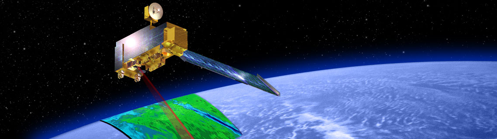

<p align="center">
   
   <br> Crédit d'image | Image credit: <a href="https://www.asc-csa.gc.ca/eng/satellites/mopitt.asp">ASC-CSA</a>
</p>

<p align="center">
    <a href="#stars">
        
    </a>
    <a href="#watchers">
        
    </a>
    <a href="https://github.com/asc-csa/MOPITT/commits/main">
        
    </a>
    <a href="https://github.com/asc-csa/MOPITT/graphs/contributors">
        
    </a>
    <a href="https://twitter.com/intent/follow?screen_name=csa_asc">
        
    </a>
</p>

---

<h3 align="center">
  <a href="#titre-du-projet">Français</a> |
  <a href="#project-title">English (follows)</a>
</h3>

---

<a id="titre-du-projet"></a>
# MOPITT - Tutoriel

> **Description brève :**
> Ce tutoriel montre comment accéder, préparer et analyser les données de l'instrument MOPITT à bord de Terra.

## À propos

**MOPITT - Tutoriel** est un tutoriel Jupyter Notebook qui guide les utilisateurs à travers l'accès, la préparation et l'analyse des données de l'instrument MOPITT à bord du satellite Terra. Il couvre :

- Accès aux données MOPITT via les archives
- Préparation et traitement des données de monoxyde de carbone
- Analyses de base et visualisations des mesures troposphériques
- Techniques de cartographie et d'analyse temporelle

MOPITT est un des cinq instruments lancés le 18 décembre 1999 à bord de Terra, un satellite de la NASA qui orbite à 705 km au-dessus de la Terre. C'est Jim Drummond, de l'Université de Toronto, qui a conçu MOPITT (*Measurements Of Pollution In The Troposphere*), fabriqué par COM DEV International.

*Ce tutoriel est fourni à des fins pédagogiques et expérimentales.*

Pour plus d'informations : [MOPITT - Université de Toronto](https://mopitt.physics.utoronto.ca)

## Prérequis

- Python 3.8
- Jupyter Notebook ou Jupyter Lab
- Connexion Internet (pour le téléchargement des données MOPITT)
- Bibliothèques scientifiques Python (NumPy, Matplotlib, etc.)

## Démarrage rapide

1. 📦 **Cloner le dépôt**
   ```bash
   git clone https://github.com/asc-csa/MOPITT.git
   cd MOPITT
   ```
2. 🐍 **Créer un environnement**
   ```bash
   # Avec virtualenv
   python -m venv env
   source env/bin/activate

   # Ou avec conda
   conda create -n mopitt_env python=3.8
   conda activate mopitt_env
   ```
3. 📥 **Installer les dépendances**
   ```bash
   pip install -r requirements.txt
   ```
4. 🚀 **Lancer le tutoriel**
   ```bash
   jupyter notebook mopitt_tutorial.ipynb
   ```

> **Remarque :** Les graphiques ne s'affichent pas dans GitHub et vous devrez configurer le projet localement pour les visualiser.

## Licence

Ce projet est sous une licence MIT modifiée – voir le fichier [LICENSE](https://github.com/asc-csa/MOPITT/blob/main/LICENSE.txt) pour plus de détails.

---

<h3 align="center">
  <a href="#project-title">English </a> |
  <a href="#titre-du-projet">Français (précède)</a>
</h3>

---

<a id="project-title"></a>
# MOPITT Tutorial

> **Brief description:**
> This tutorial demonstrates how to access, prepare, and analyze MOPITT data from the Terra satellite.

## About

**MOPITT Tutorial** is a Jupyter Notebook tutorial that guides users through accessing, preparing, and analyzing MOPITT instrument data from the Terra satellite. It covers:

- Accessing MOPITT data via archives
- Preparing and processing carbon monoxide data
- Basic analysis and visualization of tropospheric measurements
- Mapping and temporal analysis techniques

MOPITT is one of five instruments launched December 18, 1999, aboard Terra, a NASA satellite orbiting 705 km above the Earth. It was designed by Jim Drummond of the University of Toronto (*Measurements Of Pollution In The Troposphere*), manufactured by COM DEV International of Cambridge, Ontario.

*This tutorial is provided for educational and experimental purposes.*

More information: [MOPITT - University of Toronto](https://mopitt.physics.utoronto.ca)

## Prerequisites

- Python 3.8
- Jupyter Notebook or Jupyter Lab
- Internet connection (for MOPITT data download)
- Scientific Python libraries (NumPy, Matplotlib, etc.)

## Quick Start

1. 📦 **Clone the repo**
   ```bash
   git clone https://github.com/asc-csa/MOPITT.git
   cd MOPITT
   ```
2. 🐍 **Create environment**
   ```bash
   # Using virtualenv
   python -m venv env
   source env/bin/activate

   # Or using conda
   conda create -n mopitt_env python=3.8
   conda activate mopitt_env
   ```
3. 📥 **Install dependencies**
   ```bash
   pip install -r requirements.txt
   ```
4. 🚀 **Run the tutorial**
   ```bash
   jupyter notebook mopitt_tutorial.ipynb
   ```

> **Note:** Plots do not display in GitHub; you will need to set up the project locally to view visualizations.

## License

This project is licensed under a modified MIT license - see the [LICENSE](https://github.com/asc-csa/MOPITT/blob/main/LICENSE.txt) file for details.

